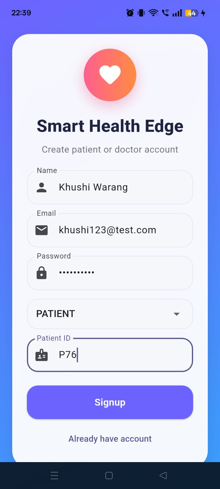
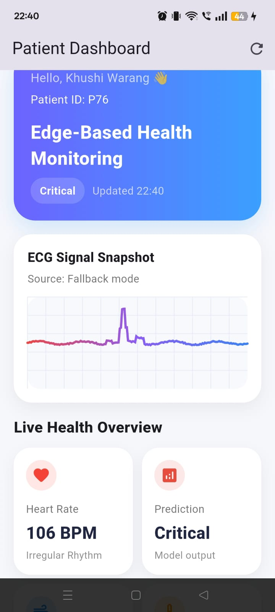
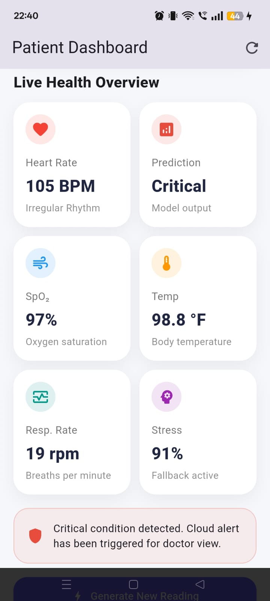
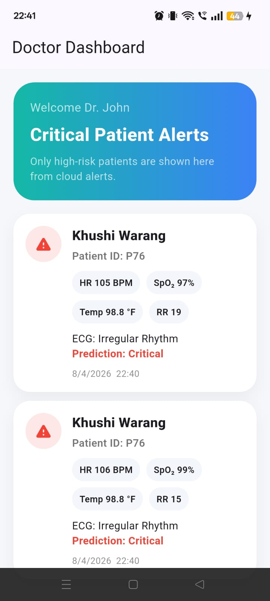

# Smart Health Monitoring System using Edge Computing

A Flutter-based Smart Health Monitoring System that leverages Edge Computing and Machine Learning for real-time health condition analysis on mobile devices.

The system uses a TensorFlow Lite model deployed directly on the device for low-latency inference. For demonstration and testing purposes, synthetic ECG and health data are generated within the application, while the machine learning model is trained using the MIT-BIH Arrhythmia Dataset.

## Features

- Edge AI inference using TensorFlow Lite
- Mobile application developed using Flutter
- Health condition classification using a 1D CNN model
- Firebase Authentication and Firestore integration
- Local data storage using Hive Database
- Critical health alert generation
- Reduced cloud dependency through Edge Computing
- Fast on-device prediction
- Role-based access for Patients and Doctors
- Synthetic ECG data generation for testing and demonstration

## Tech Stack

### Mobile Application
- Flutter
- Dart

### Machine Learning
- TensorFlow
- TensorFlow Lite
- Keras
- NumPy
- Scikit-Learn

### Backend & Database
- Firebase Authentication
- Cloud Firestore
- Hive Database

### Dataset
- MIT-BIH Arrhythmia Dataset

## Project Overview

Traditional healthcare monitoring systems rely heavily on cloud computing, resulting in increased latency and dependency on internet connectivity. This project addresses these limitations by performing health data analysis directly on mobile devices using Edge Computing.

The application simulates patient health conditions using synthetic ECG and vital sign data. A 1D Convolutional Neural Network (1D-CNN) model is trained on the MIT-BIH Arrhythmia Dataset and converted into TensorFlow Lite format for efficient mobile deployment.

Normal health records are stored locally using Hive Database, while critical health alerts are transmitted to Firebase Firestore for monitoring by healthcare professionals.

## System Architecture

```text
Synthetic ECG Data
        │
        ▼
Data Preprocessing
        │
        ▼
1D CNN Model
        │
        ▼
TensorFlow Lite Conversion
        │
        ▼
Flutter Mobile Application
        │
        ▼
On-Device Inference
        │
 ┌──────┴──────┐
 ▼             ▼
Normal      Critical
Health       Health
Status       Status
 │             │
 ▼             ▼
Hive       Firebase
Storage    Firestore
```

## Machine Learning Pipeline

1. Data collection using MIT-BIH Arrhythmia Dataset
2. ECG signal preprocessing and normalization
3. Data labeling and preparation
4. Training a 1D CNN model
5. Model evaluation and testing
6. Conversion of trained model (.h5) to TensorFlow Lite (.tflite)
7. Deployment within the Flutter mobile application
8. Real-time on-device health condition prediction

## Repository Structure

```text
SmartHealthEdgeProject/
│
├── ml_model/
│   ├── build_labeled_data.py
│   ├── train_model.py
│   ├── preprocess.py
│   ├── read_ecg.py
│   ├── read_annotations.py
│   ├── convert_tflite.py
│   ├── compare_models.py
│   ├── test_tflite.py
│   ├── ecg_model.h5
│   └── model.tflite
│
├── mobile_app/
│   ├── lib/
│   ├── assets/
│   ├── android/
│   ├── ios/
│   └── pubspec.yaml
│
├── requirements.txt
└── .gitignore
```

## Applications

- Remote patient monitoring
- Smart healthcare systems
- Elderly care assistance
- Rural healthcare environments
- Healthcare research and education
- Edge AI healthcare solutions

## Application Screenshots

### Login Screen



### Patient Registration


### ECG Monitoring Dashboard



### Critical Condition Detection



### Doctor Alert Dashboard



## Future Enhancements

- Integration with real ECG sensors and wearable devices
- Continuous health monitoring
- Advanced deep learning models such as LSTM
- Real-time push notifications
- Enhanced doctor monitoring dashboard
- Multi-patient monitoring support

## Author

**Khushi Warang**  
B.E. Artificial Intelligence & Data Science  
VES Institute of Technology
